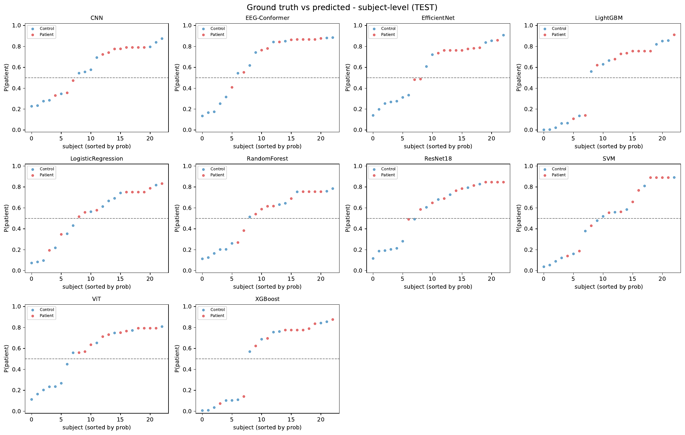
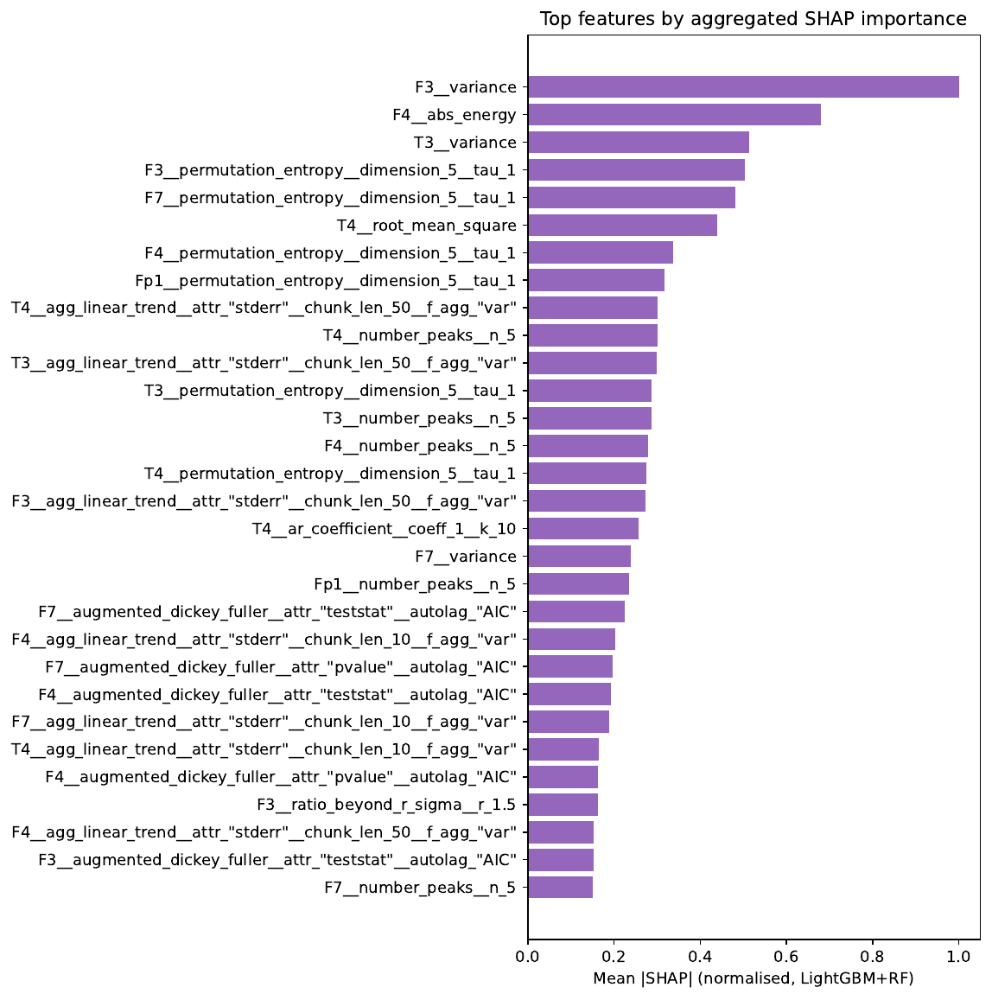
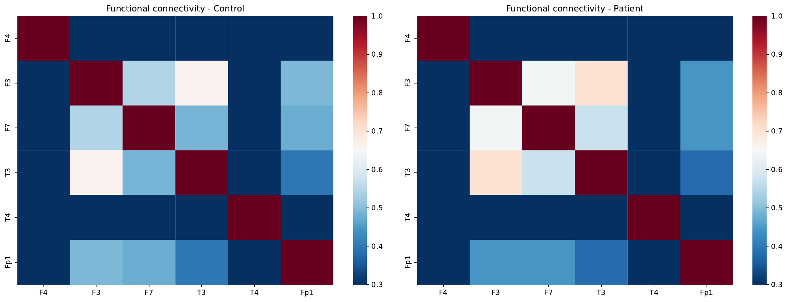
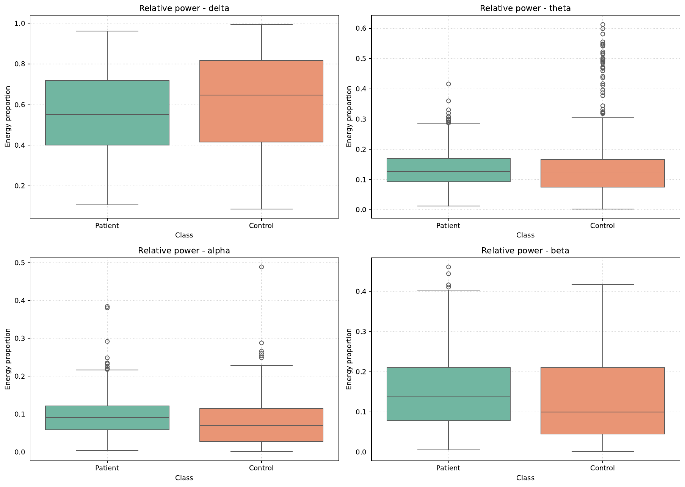
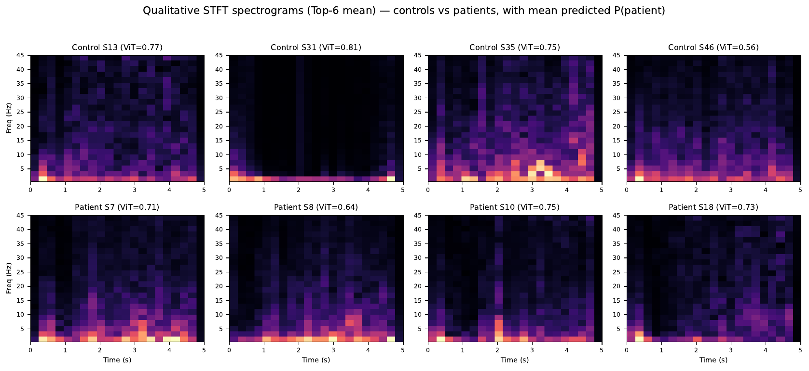
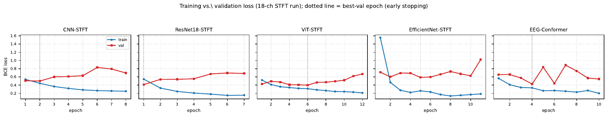
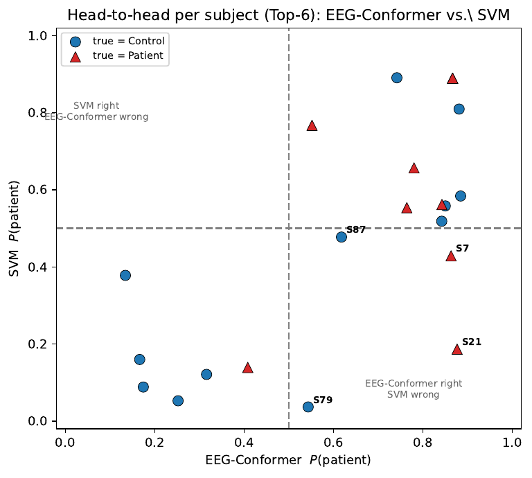

# EEG-Based Schizophrenia Detection — Classical ML vs. Deep Networks vs. Time-Series Foundation Models

Manuscript: https://drive.google.com/file/d/1cg_CIxQQpPPugyrfF2vh7xc-aLpsAomD/view?usp=sharing \
Slides: https://drive.google.com/file/d/1bTMYTI43x_VspwsefKbqjp8EedtLq6Al/view?usp=sharing

A rigorous, **leakage-free** comparative study that classifies schizophrenia
patients vs. healthy controls from EEG on the public **ASZED** dataset
(153 subjects). We benchmark three paradigms — hand-crafted `tsfresh` features +
classical ML, deep networks over time–frequency images (CNN / ResNet18 /
EfficientNet / ViT), and **Amazon Chronos** used as a *frozen* time-series
foundation model — under a strict **subject-wise** partition.

> **Headline result.** A foundation model *never trained on EEG* (Chronos) wins:
> **F1 = 0.846, Accuracy = 0.826, ROC-AUC = 0.826** (18-channel, subject-level),
> and the strongest window-level discrimination (**ROC-AUC = 0.859**) — beating
> bespoke deep nets *and* exhaustively tuned classical pipelines.

Manuscript: `main.tex` · Theory appendix: `theoretical_cheatsheet.tex` ·
Slides: `slides.tex`

---

## Key findings

- **Subject-wise partition is non-negotiable.** Random window splitting leaks a
  subject's "fingerprint" and inflates scores; we split by **subject** and report
  **subject-level** metrics (the clinical unit).
- **Foundation models transfer to EEG.** Frozen Chronos + a linear head tops the
  benchmark — *representation transfer*, not architecture search, is the deciding
  factor under limited clinical data.
- **Six fronto-temporal channels suffice.** Chronos' window-level ROC-AUC barely
  moves from 6→18 channels (0.859 → 0.856), confirming the **hyperfrontality**
  localization.
- **Wavelets do not win.** STFT is best at the window level, FFT is surprisingly
  strong at the subject level, and **CWT consistently ranks last**.
- **Classical pipelines stay competitive & auditable.** 51 SHAP-selected features
  tie one another and **beat a from-scratch CNN**, at a fraction of the cost.

---

## Results (TEST set, subject-level, Top-6 montage)

| Model | F1 | ROC-AUC | Balanced Acc |
|---|:--:|:--:|:--:|
| **Chronos** (Top-18, *winner*) | **0.846** | **0.826** | **0.833** |
| ViT (STFT) | 0.815 | 0.803 | 0.792 |
| ResNet18 (transfer) | 0.769 | 0.826 | 0.746 |
| EfficientNet | 0.720 | 0.735 | 0.701 |
| EEG-Conformer | 0.714 | 0.727 | 0.663 |
| Random Forest / XGBoost / LightGBM / LogReg | 0.692 | 0.67–0.73 | 0.659 |
| SVM | 0.667 | 0.727 | 0.655 |
| CNN (from scratch) | 0.615 | 0.652 | 0.572 |

Full per-configuration tables: `figures/top6_*.csv`, `figures/top18_*.csv`.

<p align="center">
  
  
</p>

*Left:* per-subject predicted probability vs. ground truth (controls low, patients
high). *Right:* SHAP ranking — the most discriminative features are all
**fronto-temporal** (variance/power, permutation entropy, AR(1), stationarity).

---

## Clinical EDA

<p align="center">
  
  
</p>

- **Cortical disconnection:** functional connectivity drops from **>0.8** in
  controls to **0.3–0.7** in patients.
- **Spectral shift:** patients show *less* relative delta (−0.066) and *more*
  beta/gamma (+0.018 / +0.031) — consistent with reported gamma dysregulation.

---

## Qualitative analysis

<p align="center">
  
</p>

STFT spectrograms (controls top, patients bottom) annotated with the ViT's mean
`P(patient)`. Patient spectrograms show more diffuse, higher-entropy energy; the
model's errors fall on the visually ambiguous cases.

<p align="center">
  
</p>

Training vs. validation loss: the from-scratch **CNN/EfficientNet overfit early**
(val loss diverges → early stop), while **pre-trained ViT/ResNet18 stay stable** —
the optimization-level signature of successful transfer.

<p align="center">
  
</p>

**Complementarity:** a deep signal model (EEG-Conformer) and a classical model
(SVM) each correctly classify subjects the other misses → motivates an ensemble.

---

## Pipeline

Eight standalone, resumable stages. Each reads the previous stage's artifacts
from disk (`.npy` / `.parquet`), so any script runs independently.

| Module | Stage | What it does |
|---|---|---|
| `config.py` | — | All globals: paths, `SFREQ=250`, 5 s windows, channel sets, flags |
| `1_preprocessing.py` | Load → filter → window | 0.5–45 Hz band-pass, 50 Hz notch, resample, 5 s windows, z-score, **subject-wise split** |
| `2_eda_and_dim_reduction.py` | EDA | PSD, grand average, connectivity, band power, PCA→UMAP, spectral clustering |
| `3_feature_extraction.py` | Features | **channel-by-channel `tsfresh`** (`.parquet` cache + `gc.collect()`) + `tslearn` shapelets |
| `4_feature_selection.py` | Funnel | variance → corr `>0.85` → **LightGBM+RF SHAP** → Top-K/threshold → PCA |
| `5_time_frequency_transforms.py` | Images | FFT, **STFT**, CWT (Top-6 only) |
| `6_train_ml.py` | Classical ML | LR, SVM, RF, XGBoost, LightGBM + SHAP summary |
| `7_train_dl_sota.py` | Deep / SOTA | CNN, ResNet18 (`layer4` unfrozen), ViT, EfficientNet, EEG-Conformer, **Chronos** |
| `8_evaluation.py` | Evaluation | window & **subject-level** metrics → CSVs + confusion / pred-vs-truth PDFs |

Feature funnel (Top-6): **4,662 → 1,800 → 1,204 → 51** features.

---

## Installation

```bash
python -m venv .eeg
source .eeg/bin/activate
pip install -r requirements.txt
# For GPU PyTorch, install the matching CUDA wheel first (see requirements.txt).
```

> Do **not** `pip install chronos` (an unrelated package) — it shadows
> `chronos-forecasting`. See the note in `requirements.txt`.

Place the dataset under `./ASZED-153/` (download from
[Zenodo](https://doi.org/10.5281/zenodo.14178398)).

---

## Usage

```bash
# Smoke-test end-to-end on 2 subjects first (set DEV_MODE=True in config.py)
./run_all.sh                 # run modules 1→8 in order
./run_all.sh 4 8             # run a sub-range (e.g. selection → evaluation)

# Channel ablation: set CHANNEL_SET="top18" in config.py, then
./run_all.sh 3 8             # reuses the per-channel tsfresh cache (only new channels)

# Representation ablation for the deep image models (wavelet vs STFT vs FFT)
python 7_train_dl_sota.py --repr all          # trains *-STFT, *-CWT, *-FFT
python 7_train_dl_sota.py --repr cwt,fft --no-signal   # image-only supplementary pass
python 8_evaluation.py

# Cluster
sbatch pipeline.slurm        # GPU job; forwards step ranges, e.g. sbatch pipeline.slurm 7 8
```

Key flags in `config.py`: `DEV_MODE`, `CHANNEL_SET` (`top6`/`top18`/`all19`),
`USE_GPU`, `TSFRESH_N_JOBS`, `FEATURE_SELECTION_MODE`, `DL_REPR`.

---

## Repository structure

```text
.
├── config.py                       # global configuration + shared helpers
├── 1_preprocessing.py … 8_evaluation.py
├── run_all.sh                      # local sequential orchestration
├── pipeline.slurm                  # SLURM GPU job
├── requirements.txt
├── main.tex                        # Q1 manuscript (IEEE two-column)
├── theoretical_cheatsheet.tex      # time-domain feature-extraction theory
├── slides.tex                      # Beamer presentation
├── figures/                        # all generated figures (PDF) + README PNGs + result CSVs
└── artifacts/                      # per-stage outputs (.npy/.parquet), prefixed top6_/top18_
```

---

## Reproducibility

Fixed seeds (`RANDOM_STATE=42`), strict subject-wise split, and per-configuration
artifacts (`top6_*`, `top18_*`) reproduce the reported tables exactly. The
per-channel `tsfresh` cache is shared across channel-sets so ablations are
incremental.

---

## Citation

```bibtex
@misc{acuna_velo_2026_eeg_schizophrenia,
  title  = {Schizophrenia Classification from EEG Signals: A Comparative Study of
            Classical Learning, Deep Networks and Time-Series Foundation Models},
  author = {Acu\~na Villogas, Ricardo Amiel and Velo Poma, Josu\'e Nehem\'ias},
  year   = {2026},
  note   = {Department of Data Science, UTEC, Lima, Peru},
  url    = {https://github.com/ricardoamiel/EEG-signal-prediction-for-schizophrenia-detection}
}
```

## Authors

- **Ricardo Amiel Acuña Villogas** — UTEC, Data Science · [ORCID 0009-0005-7543-2232](https://orcid.org/0009-0005-7543-2232) · ricardo.acuna@utec.edu.pe
- **Josué Nehemías Velo Poma** — UTEC, Data Science · josue.velo@utec.edu.pe

## Acknowledgments

Department of Data Science, UTEC — *Time Series* course. Dataset: ASZED (African
Schizophrenia EEG Dataset), Zenodo.